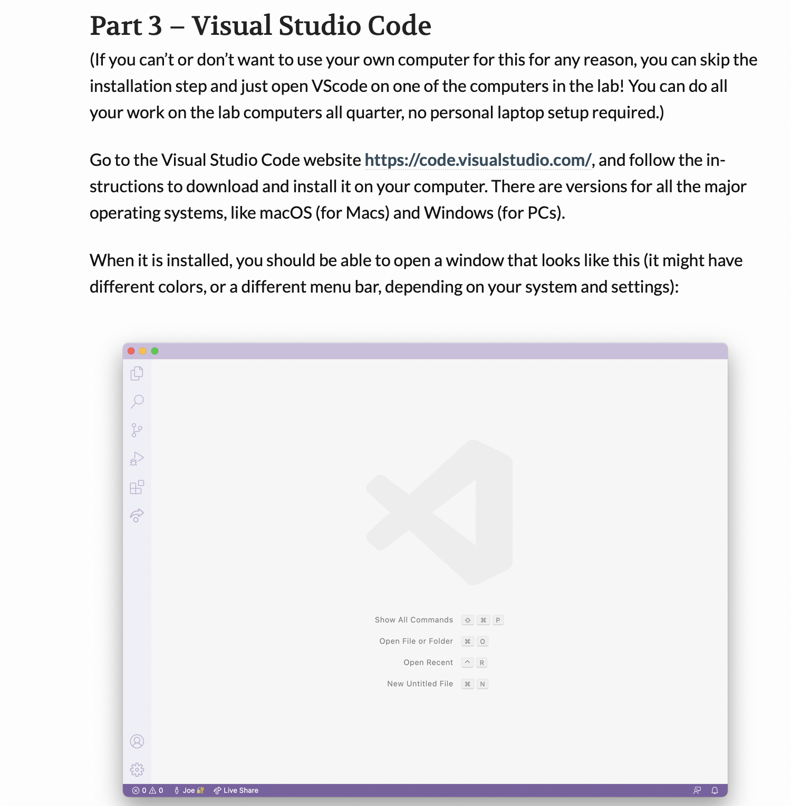
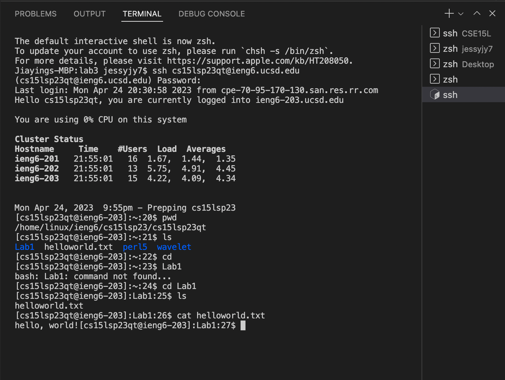
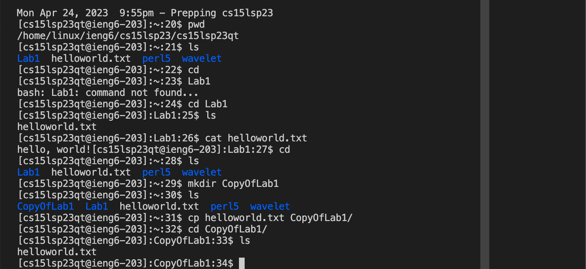
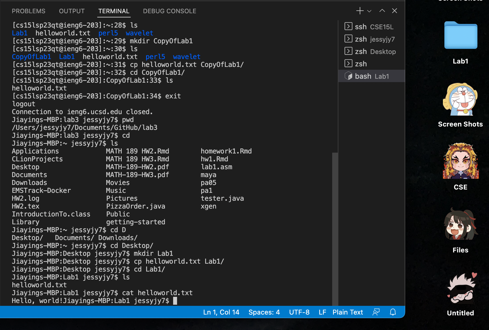
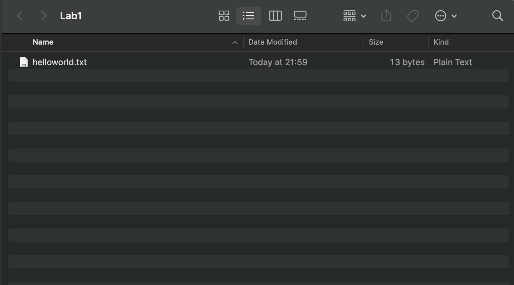

# Lab Report 1
## There will be three parts of instructions for the incoming CSE 15L students to finish lab 1
* VS code download(I downloaded this before so I will use the instructions professor gave)
* Access/exit ieng6 accounts
* Try out some simple commands(e.g. pwd, cd,ls, mkdir, cp, cat)

## Part 1: Download VS Code
Since I have VS Code downloaded a long time ago, I'll post the detailed steps Professor shared. The image below includes all the details. 
The general steps are:
1. Open VS Code website and find the right version to download.
2. Follow the instructions of setting up environment.
3. Open a new file and name it "helloworld.txt" and include "hello,world!" as its content.

## Part 2: Access/exit ieng6 accounts
Then we start our access process by using VS Code Terminal
1. type "scp helloworld.txt cs15lsp23xx@ieng6.ucsd.edu" and type in your password to upload the file to your account's remote computer first.
(I did this ahead so I won't show the process)
3. typr "ssh cs15lsp23qt@ieng6.ucsd.edu" then type in your password again to access the remote computer.
4. If you see image similar like below, you made it to access ieng6 accounts.
5. Then copy the commands I included in the image below to try out their functions within the remote computer.
6. type "exit" in the command to logout.(command is included in the first image of part 3)

## Part 3: Try out some simple commands
We can try the same steps at our local computer as well.
The steps included in the image below allows the local computer to make(use mkdir) one folder called Lab1 in Desktop and copy(ucs cp) helloworld.txt into that folder.
Then it use cat to print out the content of the helloworld.txt file inside of the Lab1 folder.

